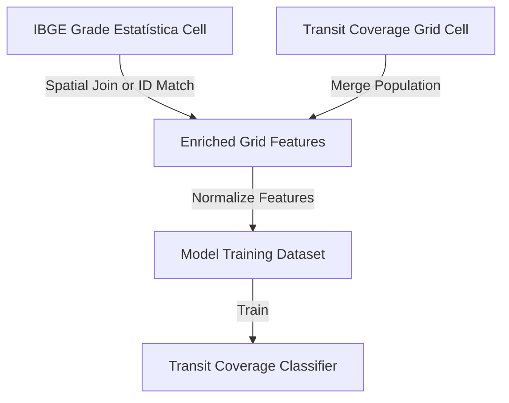

# Data Model: IBGE Population Data Integration

**Date**: 2025-12-10  
**Feature**: 002-population-integration  
**Status**: Complete

## Overview

This document defines the data entities, schemas, and relationships for integrating IBGE population data into the transit coverage classification pipeline. The data model supports the transition from 250m to 200m grid resolution and the enrichment of transit features with population counts.

---

## Entity Definitions

### 1. IBGE Grade Estatística Cell

**Description**: A 200-meter resolution census grid cell from IBGE Censo 2022, containing population count and geographic boundaries.

**Source**: `data/raw/ibge_populacao_bh_grade_id36.zip` (IBGE official release)

**Schema**:
```python
{
    "ID36": str,           # 36-character quadtree-based cell identifier (e.g., "E2665N75155...")
    "POP": int,            # Total population count (>= 0)
    "geometry": Polygon,   # Shapely Polygon in SIRGAS 2000 (EPSG:4674) or WGS84 (EPSG:4326)
}
```

**Constraints**:
- `ID36`: Required, unique, non-empty string
- `POP`: Required, non-negative integer (0 = uninhabited)
- `geometry`: Required, valid polygon with 200m nominal side length

**Expected record count**: 15,000-20,000 cells for Belo Horizonte + 2km buffer

**Validation rules**:
- Total population sum should match BH census total: 2.3M-2.5M (±10%)
- Individual cell population range: 0-3,000 (lower max than 250m cells)
- Zero-population cells should be <10% of total (SC-005)

---

### 2. Transit Coverage Grid Cell (200m)

**Description**: A regenerated 200-meter resolution analysis grid cell containing transit infrastructure metrics.

**Source**: Generated by `src/data/grid_generator.py` with updated config

**Schema**:
```python
{
    "cell_id": str,              # Unique identifier (UUID or grid coordinate-based)
    "geometry": Polygon,         # Shapely Polygon in WGS84 (EPSG:4326)
    "centroid_lat": float,       # Latitude of cell centroid [-20.05, -19.75]
    "centroid_lon": float,       # Longitude of cell centroid [-44.09, -43.84]
    "area_km2": float,           # Cell area in km² (should be ~0.04 for 200m cells)
    "stop_count": int,           # Number of transit stops in cell (>= 0)
    "route_count": int,          # Number of unique routes serving cell (>= 0)
    "daily_trips": int,          # Total daily trips through cell (>= 0)
    "stop_density": float,       # Stops per km² (derived: stop_count / area_km2)
    "route_diversity": float,    # Normalized route variety metric [0, 1]
}
```

**Constraints**:
- `cell_id`: Required, unique, non-empty string
- `geometry`: Required, valid 200m × 200m polygon (±5% tolerance)
- Transit metrics: Non-negative integers, allow zeros (rural/edge cells)
- Spatial bounds: Within Belo Horizonte + 2km buffer

**Expected record count**: 15,000-20,000 cells (matches IBGE coverage)

**Generation logic**:
- Grid aligned to lat/lon coordinates, 200m spacing
- Covers bounding box: lat[-20.046, -19.758], lon[-44.081, -43.844]
- CRS: EPSG:4326 (WGS84) for consistency

---

### 3. Enriched Grid Features

**Description**: The merged dataset combining transit metrics and population data for each 200m cell.

**Source**: Output of `src/data/population_integrator.py`

**Schema**:
```python
{
    # Grid identification
    "cell_id": str,              # From Transit Coverage Grid
    "geometry": Polygon,         # Preserved from grid
    "centroid_lat": float,
    "centroid_lon": float,
    "area_km2": float,
    
    # Transit features (from feature_extractor.py)
    "stop_count": int,
    "route_count": int,
    "daily_trips": int,
    "stop_density": float,
    "route_diversity": float,
    
    # Population feature (NEW - from IBGE merge)
    "population": int,           # Total population in cell (>= 0)
    
    # Normalized features (for model training)
    "stop_count_norm": float,    # StandardScaler normalized
    "route_count_norm": float,
    "daily_trips_norm": float,
    "population_norm": float,    # NEW - StandardScaler normalized
    
    # Labels (from label_generator.py)
    "transit_score": float,      # Composite score [0, 1]
    "label": str,                # "well_served" or "underserved"
    "label_binary": int,         # 1 = well_served, 0 = underserved
}
```

**Constraints**:
- All fields from Transit Coverage Grid: preserved
- `population`: Required, non-negative, merged from IBGE data
- `population_norm`: Calculated after merge, mean ≈ 0, std ≈ 1
- Missing population values: Should be <5% of cells (SC-003), filled with 0 or flagged

**Expected record count**: 15,000-20,000 cells (same as grid)

**File format**: Parquet with snappy compression
**File path**: `data/processed/features/grid_features.parquet`

**Validation rules**:
- Total population sum = IBGE total ±10%
- Population coverage: >95% cells have non-null population (SC-003)
- Normalized features: mean ≈ 0, std ≈ 1 (tolerance ±0.01)
- File size: Expected 5-10 MB (15% increase from baseline per SC-008)

---

## Entity Relationships



**Relationship details**:

1. **IBGE Cell → Enriched Grid** (1:1 or 1:0)
   - Match method: `ID36` direct merge (preferred) OR spatial join by centroid/intersection
   - Unmatched IBGE cells: Ignored (outside grid bounds)
   - Unmatched grid cells: Flagged for investigation, population = 0 as fallback

2. **Grid Cell → Enriched Grid** (1:1)
   - All grid cells preserved in enriched dataset
   - Population field added via left join (grid cells are "left" side)

3. **Enriched Grid → Model Dataset** (1:1)
   - Feature normalization applied
   - Labels generated based on transit_score threshold
   - Train/validation/test split applied

---

## Data Transformations

### Transformation 1: IBGE Data Loading

**Input**: `data/raw/ibge_populacao_bh_grade_id36.zip`  
**Output**: GeoDataFrame with IBGE cells  
**Module**: `src/data/population_integrator.py::load_ibge_data()`

**Steps**:
1. Read shapefile from ZIP using PyOGRIO engine
2. Validate required columns: `POP`, `geometry` (and optionally `ID36`)
3. Filter to Belo Horizonte bounds + 2km buffer
4. Reproject to EPSG:4326 if needed
5. Validate population values: non-negative, realistic range

**Error handling**: Fail-fast per FR-004 if file missing, corrupted, or schema invalid

---

### Transformation 2: Grid Regeneration at 200m

**Input**: `config/model_config.yaml` (updated grid.cell_size_meters = 200)  
**Output**: `data/processed/grids/grid_200m.parquet`  
**Module**: `src/data/grid_generator.py`

**Steps**:
1. Read bounding box from config
2. Generate 200m × 200m grid cells
3. Assign unique cell_id to each cell
4. Calculate centroid coordinates and area
5. Save as Parquet with geometry column

**Performance target**: <90 seconds for ~15k cells

---

### Transformation 3: Transit Feature Extraction

**Input**: `data/processed/grids/grid_200m.parquet` + GTFS data  
**Output**: `data/processed/features/grid_features_transit_only.parquet`  
**Module**: `src/data/feature_extractor.py`

**Steps**:
1. Load 200m grid
2. Load GTFS stops, routes, trips
3. Spatial join: count stops per cell
4. Aggregate routes per cell
5. Calculate daily trips per cell
6. Compute derived features (density, diversity)
7. Save transit features

**Performance target**: <7 minutes for ~15k cells

---

### Transformation 4: Population Integration

**Input**: Transit features + IBGE population data  
**Output**: `data/processed/features/grid_features.parquet` (enriched)  
**Module**: `src/data/population_integrator.py::merge_population()`

**Steps**:
1. Load transit features GeoDataFrame
2. Load IBGE population data (via `load_ibge_data()`)
3. Attempt ID36 merge if available, else spatial join
4. Add `population` column to grid features
5. Fill unmatched cells with 0 and log warning
6. Validate merge: check coverage rate, total population sum
7. Save enriched features

**Performance target**: <20 seconds for spatial join of ~15k cells

---

### Transformation 5: Feature Normalization

**Input**: Enriched grid features (raw values)  
**Output**: Enriched grid features with normalized columns  
**Module**: `src/data/preprocessing.py` or `src/models/train.py`

**Steps**:
1. Load enriched features
2. Define feature columns: `['stop_count', 'route_count', 'daily_trips', 'population']`
3. Apply StandardScaler: mean = 0, std = 1
4. Add normalized columns with `_norm` suffix
5. Validate normalization statistics
6. Save or pass to model training

**Performance target**: <5 seconds (in-memory operation)

---

## Configuration Schema

### Updated `config/model_config.yaml`

```yaml
# Geographic Grid Configuration
grid:
  cell_size_meters: 200  # CHANGED from 250 to match IBGE resolution
  
  bounds:
    lat_min: -20.046411
    lat_max: -19.758246
    lon_min: -44.081380
    lon_max: -43.843522
  
  expected_cells: 17000  # UPDATED from 13000 (approximate for 200m grid)
  expected_area_km2: 0.04  # UPDATED from 0.0625 (0.2km × 0.2km)

# Feature Extraction Configuration
features:
  # Existing weights (used for composite scoring, not feature weighting)
  stop_count_weight: 0.4
  route_count_weight: 0.3
  daily_trips_weight: 0.3
  
  normalization_method: "StandardScaler"
  include_density: true
  include_diversity: true
  
  # NEW: Population-specific settings
  population:
    source_file: "data/raw/ibge_populacao_bh_grade_id36.zip"
    required_column: "POP"  # Strict column name requirement
    min_expected_population: 0
    max_expected_population: 3000  # Flag cells exceeding this
    coverage_threshold: 0.95  # Minimum fraction of cells with population data

# Training Configuration
training:
  random_seed: 42
  test_size: 0.15
  val_size: 0.15
  cv_folds: 5
  stratify: true
  n_jobs: -1
  
  # NEW: Feature set definition
  features:
    transit: ["stop_count", "route_count", "daily_trips"]
    demographic: ["population"]
    derived: ["stop_density", "route_diversity"]  # Optional

# Models (unchanged, existing hyperparameter spaces)
models:
  logistic_regression:
    search_method: "grid"
    param_grid:
      C: [0.01, 0.1, 1.0, 10.0]
      penalty: ["l2"]
      max_iter: [1000]
  # ... (rest unchanged)
```

---

## Data Quality Checks

### Pre-Merge Validation

**IBGE Data**:
- ✅ File exists at expected path
- ✅ ZIP readable, shapefile valid
- ✅ Required columns present: `POP`, `geometry`
- ✅ Population values non-negative
- ✅ Total population within expected range [2.0M, 2.8M]
- ✅ Cell count within expected range [14k, 22k]

**Grid Data**:
- ✅ Cell size = 200m (±5% tolerance)
- ✅ All cells within defined bounds
- ✅ No overlapping or duplicate cells
- ✅ Cell count matches expected (~17k)

---

### Post-Merge Validation

**Enriched Features**:
- ✅ Population coverage >95% of cells (SC-003)
- ✅ Total population sum = IBGE total ±10% (SC-010)
- ✅ Zero-population cells <10% of total (SC-005)
- ✅ Mean population (populated cells only): 60-400 per cell (SC-004)
- ✅ File size increase <15% from baseline (SC-008)
- ✅ No null geometries
- ✅ Normalized features: mean ≈ 0, std ≈ 1

---

### Runtime Monitoring

**Performance Metrics**:
- ✅ Grid generation: <90 seconds
- ✅ Feature extraction: <7 minutes
- ✅ Population integration: <20 seconds
- ✅ Total pipeline: <10 minutes (SC-002)

**If thresholds exceeded**: Fail immediately per FR-017 with suggestions:
- Reduce geographic bounds
- Upgrade hardware (RAM, CPU)
- Enable chunked processing mode

---

## Summary Statistics Output

After population integration, the pipeline MUST log (FR-012):

```python
{
    "total_population": 2_400_000,  # Sum of all cells
    "total_cells": 17_000,
    "populated_cells": 15_500,      # Cells with pop > 0
    "zero_pop_cells": 1_500,        # 8.8% (within <10% threshold)
    "zero_pop_pct": 0.088,
    "min_pop": 0,
    "max_pop": 2_850,
    "mean_pop_all": 141.2,          # Including zeros
    "mean_pop_populated": 154.8,    # Excluding zeros (used for reporting)
    "median_pop": 120,
    "coverage_rate": 0.97,          # 97% cells have population data
}
```

---

**Next Steps**: Generate API contracts (if applicable) and quickstart guide for Phase 1 completion.
